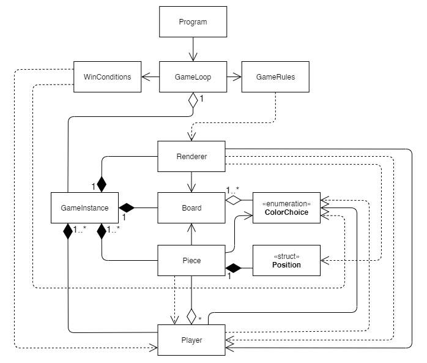

# LP1 Projeto 2 - Felli

## Autoria

### Grupo 04

[Afonso Rosa](https://github.com/AfonsoGR) &nbsp;&nbsp;&nbsp;&nbsp;- a21802169  
[André Vitorino](https://github.com/Freeze88-2) - a21902663  

O repositório utilizado pode ser encontrado 
[aqui](https://github.com/AfonsoGR/LP1_Project2).

# Distribuição do Projeto

#### Afonso Rosa

O aluno, Afonso Rosa, foi o responsável pelas classes `Piece.cs`, `Player.cs`,
`WinConditions.cs`, `GameRules.cs` e `ColorChoice.cs`, tendo sido o responsável
pela lógica, estruturação e funcionamento das mesmas, embora isto não tenha sido
obtido sem o apoio do colega que ajudou na otimização e no funcionamento das
mesmas, tendo recibo ajuda maioritariamente nas classes `Piece.cs` e
`WinConditions.cs`.

Tratou ainda da documentação das classes `Piece.cs`, `WinConditions.cs`,
`Program.cs`, `Position.cs` e o `GameRules.cs` tendo confirmado com o colega a
credibilidade da mesma.

Foi um dos principais responsáveis pelo (ficheiro `README.md`), tendo
confirmado a clareza e veracidade do conteúdo do mesmo com o colega.

#### André Vitorino

O aluno, André Vitorino, foi o responsável pelas classes `Board.cs`,
`Program.cs`, `Board.cs`, `GameLoop.cs`, `GameInstance.cs` e `Position.cs` tendo
sido o responsável pela lógica, estruturação e funcionamento das mesmas.
ajudou o colega maioritariamente nas classes `Piece.cs` e `WinConditions.cs`.

O aluno também fez otimizações noutras classes pertencentes ao colega.

Tratou ainda documentação das classes `Renderer.cs`, `GameLoop.cs`,
`GameInstance.cs`, `Player.cs`, `ColorChoice.cs`e `Board.cs`.

Foi um dos principais responsáveis pelo (ficheiro `README.md`), tendo
confirmado a clareza e veracidade do conteúdo do mesmo com o colega.

# Arquitetura da solução

### Descrição da solução
O projeto tem como ponto principal a classe `GameInstance`, sendo a classe que
contem o jogo em si, criando e guardando os elementos necessários para que o
jogo funcione. A classe `GameLoop` utiliza então este `GameInstance` para correr
o loop principal do jogo, pedindo aos jogadores criados pelo `GameInstance`
para fornecer inputs e pedir ás suas peças (um array de `Piece`) para atualizar
a sua posição, seguidamente utilizando a classe `WinConditions` para verificar
se alguma das peças do jogador adversário tem algum movimento possivel.

A classe `Board` contém as cores das peças no tabuleiro sendo utilizado pelo
`Renderer` para visualizar o estado atual de todas as peças existentes, esta
pede a tudas as peças para atualizarem a sua posição no tabuleiro e visuais para
que possa mostrar ao utilizador todas as peças no tabuleiro na posição correta.

Finalmente a classe `ColorChoice` indica a cor da peça ou do jogador e a
`Position` é um vetor que indica a posição no X e Y da peça.

# Diagrama UML

# Referências

Foi consultada a 
[API&nbsp;do&nbsp;C#](
    ps://docs.microsoft.com/en-us/dotnet/api/system?view=netcore-3.1) online.
    
Foram reaproveitados elementos do
[projeto](https://github.com/AfonsoGR/LP1_Projeto_1) anterior destes alunos
realizado para esta cadeira.
